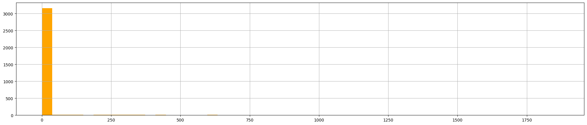

# Statistical Constructs or: How I Learned to Use the Standard Deviation

I’m continuing the series of reviewing the book [Cyber Threat Hunting](https://www.manning.com/books/cyber-threat-hunting), by Nadhem AlFardan, published by Manning. I already made two blog posts about [Chapter 3](https://lucavauda.bearblog.dev/my-first-threat-hunting-expedition/) and [Chapter 4](https://lucavauda.bearblog.dev/threat-intel-4-threat-hunt/). This can be read standalone, but reading the other two for context could be useful. Bonus points if you recognize the title inspiration. 😃

You will find the specific files for the chapter in question at this [link](https://github.com/lucavauda/CyberThreatHunting_TechReview/tree/main/chapter4) (my GitHub repo).

This is Chapter 6 called **Using Fundamental Statistical Constructs**.

# **Using Fundamental Statistical Constructs**

The presented scenario is the following:

> You have been tasked to look for signs of malicious beaconing activities to command and control (C2) servers from internal hosts to external IP addresses, regardless of the network port. In this setting, infected internal hosts would periodically try to connect to one or more C2 servers hosted externally on a regular basis, hence the term beaconing.
> 

Elements we need to pay attention to:

- Connection with the same source IP address, destination IP address and port at a regular interval;
- Data packets;
- Build a set of given packets to apply some stats (such as variance and standard variation).

### Mean, Variance and Standard Deviation

I will give a bit of statistical background (note to the reader: this is basically for me when I review the material).

Imagine you're a **network administrator** monitoring how many **connections** come into your server **each hour**, and you're particularly interested in which **ports** are being used (say, port 80 for HTTP, port 443 for HTTPS, etc.).

Over 24 hours, you collect data like:

```
Hour 1: 100 connections to port 80  
Hour 2: 105 connections to port 80  
Hour 3: 102 connections to port 80  
...  
Hour 24: 400 connections to port 80
```

- You first calculate the **average number of connections per hour** to port 80. Let's say it comes out to **150 connections/hour**.
- **Variance** tells you **how much the number of connections fluctuates** from that average. It’s like asking:

> “How unpredictable is the number of connections per hour?”
> 

If most hours have numbers close to 150, the variance is **low, and** your traffic is **stable**. If some hours have 20 connections and others have 400, the variance is **high, and** your traffic is **erratic**.

It’s calculated by taking the **average of the squared differences** from the mean (which exaggerates outliers).

- **Standard deviation** is just the **square root of the variance**, putting it **back in the same units** as the original data (e.g., connections/hour).

So if variance is like seeing the "spread" squared, **standard deviation is the actual spread**. We can use it to see how far, on average, each hour's connections differ from the mean.

### 💡 TL;DR

- Think of **variance** as how "noisy" the network traffic is around an expected average.
- Think of **standard deviation** as a **typical deviation:** how much traffic normally goes up or down from the mean.
- High variance/standard deviation → unpredictable traffic
- Low variance/standard deviation → stable, predictable traffic

## Initial analysis

I will use Google Colab and the data provided in the original GitHub repo that you can find [here](https://github.com/threat-hunt/data/tree/main/chapter6) (I unzipped the CVS file and uploaded it into Colab). For the sake of the blog post, I will skip the “data acquisition” part, focusing only on **data manipulation**.

## Data Preparation

Let’s move on and start preparing the data. I will use Python in Google Colab as I said before. We’ll use pandas, a famous library for data manipulation. Let’s start with reading the CSV file.

```python
import pandas as pd

df_original = pd.read_csv("/content/ch6_stream_events.csv", low_memory=False)
print(len(df_original))
df = df_original
```

The length of the file (how many rows in the CSV file) is 667827. To focus our analysis on connections with a reasonable amount of activity, we filter for groups having more than 100 records and we will count how many records share the same `src_ip`, `dest_ip`, `dest_port`.

```python
count_threshold = 100
df = df.groupby(['src_ip', 'dest_ip', 'dest_port']).filter \
    (lambda x : len(x)>count_threshold)
df = df.reset_index()
print(len(df.index), "records with count >", count_threshold)
511346 records with count > 100
```

The result is: 511346 records with count > 100. Then, use the `dtypes`method, which returns a Series with the data type of each column. The result’s index is the original DataFrame’s columns.

```python
df.dtypes
```

| index | int64 |
| --- | --- |
| Unnamed: 0 | int64 |
| sourcetype | object |
| endtime | object |
| timestamp | object |
| ... | ... |
| uri_parm | object |
| message_type | object |
| query | object |
| query_type | object |
| transaction_id | float64 |

Then, the following code snippet processes a DataFrame containing date and time information by converting the `timestamp` and `endtime` columns into datetime objects using Pandas' `to_datetime` function with the `format='mixed'` option, which allows parsing of date strings in different formats. Once converted, these datetime objects are transformed into Unix epoch timestamps, which is the number of seconds elapsed since January 1, 1970. The resulting epoch times are stored in two new columns: `epoch_timestamp` and `epoch_endtime`. Finally, the script displays a subset of the DataFrame to verify the correctness of the datetime-to-epoch conversions.

```python
df['timestamp'] = pd.to_datetime(df['timestamp'], format='mixed')
df['endtime'] = pd.to_datetime(df['endtime'], format='mixed')
df['epoch_timestamp'] = df['timestamp'].astype('int64') // 10**9
df['epoch_endtime'] = df['endtime'].astype('int64') // 10**9
```

This is how to print the data/time to epoch conversion:

```python
df[['timestamp', 'epoch_timestamp', 'endtime', 'epoch_endtime']]
```

| timestamp | epoch_timestamp | endtime | epoch_endtime |
| --- | --- | --- | --- |
| 0 | 2022-07-27 14:46:54.346452+00:00 | 1658933214 | 2022-07-27 14:46:54.346488+00:00 |
| 1 | 2022-07-27 14:46:53.839881+00:00 | 1658933213 | 2022-07-27 14:46:53.839898+00:00 |
| 2 | 2022-07-27 14:46:53.332432+00:00 | 1658933213 | 2022-07-27 14:46:53.332470+00:00 |
| 3 | 2022-07-27 14:46:52.595835+00:00 | 1658933212 | 2022-07-27 14:46:53.566740+00:00 |
| 4 | 2022-07-27 14:46:52.682650+00:00 | 1658933212 | 2022-07-27 14:46:53.565587+00:00 |
| ... | ... | ... | ... |
| 58128 | 2022-07-27 01:29:45.584724+00:00 | 1658885385 | 2022-07-27 01:29:45.610380+00:00 |
| 58129 | 2022-07-27 01:29:44.080049+00:00 | 1658885384 | 2022-07-27 01:29:44.156219+00:00 |
| 58130 | 2022-07-27 01:29:46.653601+00:00 | 1658885386 | 2022-07-27 01:29:46.701343+00:00 |
| 58131 | 2022-07-27 01:29:50.178359+00:00 | 1658885390 | 2022-07-27 01:29:50.182597+00:00 |
| 58132 | 2022-07-27 01:30:01.236565+00:00 | 1658885401 | 2022-07-27 01:30:01.408579+00:00 |

After that, the following code performs data cleaning and type enforcement on a Pandas DataFrame. First, it sorts the DataFrame in ascending order based on the `epoch_timestamp` column, ensuring that the records are ordered chronologically. Then, it explicitly converts several columns, `epoch_timestamp`, `epoch_endtime`, `bytes`, and `bytes_in`, to integers using the `.astype(int)` method. This step ensures consistent data types, which is important for numerical operations, comparisons, and avoiding type-related errors during analysis or further processing. Finally, `df.dtypes` is called to display the data types of all columns in the DataFrame, allowing the user to verify that the type conversions were applied correctly.

```python
df = df.sort_values(by=['epoch_timestamp'], ascending=True)
df['epoch_timestamp'] = df['epoch_timestamp'].astype(int)
df['epoch_endtime'] = df['epoch_endtime'].astype(int)
df['bytes'] = df['bytes'].astype(int)
df['bytes_in'] = df['bytes_in'].astype(int)
df.dtypes
```

|  | 0 |
| --- | --- |
| index | int64 |
| Unnamed: 0 | int64 |
| sourcetype | object |
| endtime | datetime64[ns, UTC] |
| timestamp | datetime64[ns, UTC] |
| ... | ... |
| query | object |
| query_type | object |
| transaction_id | float64 |
| epoch_timestamp | int64 |
| epoch_endtime | int64 |

Then, we use the head method. This function returns the first n rows for the object based
on position. It is useful for quickly testing if your object has the right type of data in it.

```python
print(df.head())
```

Not going to report the results but now we have a DataFrame ready to do some processing.

## Process data

Let’s calculate the time difference between connections: we will calculate the time difference, in seconds, between consecutive events that share the same source IP (`src_ip`), destination IP (`dest_ip`), and destination port (`dest_port`). We’ll first group the DataFrame by these three columns, then applying a transformation to the `epoch_timestamp` column within each group. Specifically, it subtracts the previous row’s timestamp from the current one using `x - x.shift(1)`, which results in the difference in seconds between successive events in the same connection flow. The resulting time differences are stored in a new column called `time_diff_sec`, allowing for analysis of timing patterns or delays between packets or sessions.

```python
df['time_diff_sec'] = df.groupby(['src_ip', 'dest_ip', 'dest_port'])\
['epoch_timestamp'].transform(lambda x: x - x.shift(1))
```

The `.transform()` method is used here to calculate these statistics for each group (defined by `src_ip`, `dest_ip`, `dest_port`) and then align and broadcast these calculated values back to all rows belonging to that group. This means every row in the original `df` (that met the `count_threshold`) will now be annotated with the standard deviation, variance, and count of its respective connection group.

Then, let’s calculate the standard deviation, the variance and the number of connections.

```python
df['std1'] = df.groupby(['src_ip', 'dest_ip', 'dest_port'])\
['time_diff_sec'].transform('std')
df['var1'] = df.groupby(['src_ip', 'dest_ip', 'dest_port'])\
['time_diff_sec'].transform('var')
df['count1'] = df.groupby(['src_ip', 'dest_ip', 'dest_port'])\
['time_diff_sec'].transform('count')
df[['var1','std1']].sort_values(by=['std1'], ascending=True)
```

| var1 | std1 |
| --- | --- |
| 256142 | 6.451613e-03 |
| 389546 | 6.451613e-03 |
| 165903 | 6.451613e-03 |
| 446573 | 6.451613e-03 |
| 342809 | 6.451613e-03 |
| ... | ... |
| 4405 | 1.582323e+07 |
| 37905 | 1.582323e+07 |
| 38214 | 1.582323e+07 |
| 93675 | 1.582323e+07 |
| 93772 | 1.582323e+07 |

Here’s a few columns in the DataFrame:

```python
df[['src_ip', 'dest_ip', 'dest_port', 'std1', 'var1', 'count1', 'app']]\
.sort_values(by=['std1'], ascending=True)
```

| src_ip | dest_ip | dest_port | std1 | var1 | count1 | app |
| --- | --- | --- | --- | --- | --- | --- |
| 256142 | 10.0.0.8 | 52.226.139.185 | 443 | 0.080322 | 6.451613e-03 | 155 |
| 389546 | 10.0.0.8 | 52.226.139.185 | 443 | 0.080322 | 6.451613e-03 | 155 |
| 165903 | 10.0.0.8 | 52.226.139.185 | 443 | 0.080322 | 6.451613e-03 | 155 |
| 446573 | 10.0.0.8 | 52.226.139.185 | 443 | 0.080322 | 6.451613e-03 | 155 |
| 342809 | 10.0.0.8 | 52.226.139.185 | 443 | 0.080322 | 6.451613e-03 | 155 |
| ... | ... | ... | ... | ... | ... | ... |
| 4405 | 10.0.0.10 | 108.138.128.47 | 443 | 3977.842291 | 1.582323e+07 | 107 |
| 37905 | 10.0.0.10 | 108.138.128.47 | 443 | 3977.842291 | 1.582323e+07 | 107 |
| 38214 | 10.0.0.10 | 108.138.128.47 | 443 | 3977.842291 | 1.582323e+07 | 107 |
| 93675 | 10.0.0.10 | 108.138.128.47 | 443 | 3977.842291 | 1.582323e+07 | 107 |
| 93772 | 10.0.0.10 | 108.138.128.47 | 443 | 3977.842291 | 1.582323e+07 | 107 |

Let’s drop the duplicates, creating a new DataFrame:

```python
unique_df = df.drop_duplicates(['src_ip', 'dest_ip', 'dest_port'])
unique_df[['src_ip', 'dest_ip', 'dest_port', 'std1', 'var1',\
'count1', 'app']].sort_values(by=['std1'], ascending=True)
```

| src_ip | dest_ip | dest_port | std1 | var1 | count1 | app |
| --- | --- | --- | --- | --- | --- | --- |
| 65430 | 10.0.0.8 | 52.226.139.185 | 443 | 0.080322 | 6.451613e-03 | 155 |
| 4782 | 10.0.0.7 | 52.226.139.121 | 443 | 0.094701 | 8.968244e-03 | 222 |
| 10220 | 10.0.0.6 | 52.226.139.185 | 443 | 0.277019 | 7.673964e-02 | 222 |
| 4577 | 10.0.0.12 | 52.226.139.121 | 443 | 0.286851 | 8.228333e-02 | 170 |
| 7051 | 10.0.0.12 | 44.238.73.15 | 9997 | 0.309736 | 9.593646e-02 | 1378 |
| ... | ... | ... | ... | ... | ... | ... |
| 32756 | 10.0.0.7 | 173.222.170.99 | 80 | 2627.209391 | 6.902229e+06 | 115 |
| 24176 | 10.0.0.4 | 173.222.170.99 | 80 | 2871.318325 | 8.244469e+06 | 105 |
| 94900 | 10.0.0.11 | 192.111.4.10 | 443 | 3342.416695 | 1.117175e+07 | 168 |
| 87408 | 10.0.0.10 | 108.138.128.122 | 443 | 3663.833032 | 1.342367e+07 | 104 |
| 38214 | 10.0.0.10 | 108.138.128.47 | 443 | 3977.842291 | 1.582323e+07 | 107 |

## Identifying Beaconing

Now, we will try to identify **beaconing behavior**, which often involves network activity that occurs at regular intervals and is thus characterized by low variability in timing.

First, it sets a threshold value `std_threshold` to 100, which will be used to filter data based on the standard deviation of timing intervals. Then, it filters the `unique_df` DataFrame to retain only the rows where `std1` is less than this threshold, indicating more regular or periodic activity. After filtering, the DataFrame is sorted by the `dest_ip` column in ascending order to organize the data by destination IP address. Finally, it selects and displays specific columns — including source and destination IPs, destination port, standard deviation (`std1`), variance (`var1`), count of events (`count1`), and application type (`app`) — and sorts this output by `std1` in ascending order. This makes it easier to visually inspect rows with the lowest timing variability, which may indicate potential beaconing.

```python
std_threshold = 100
unique_df = unique_df.loc[unique_df['std1'] <  \
std_threshold].sort_values(by=['dest_ip'], ascending=True)
unique_df[['src_ip', 'dest_ip', 'dest_port', \
'std1', 'var1', 'count1',  'app']].sort_values(by=['std1'], ascending=True)
```

| src_ip | dest_ip | dest_port | std1 | var1 | count1 | app |
| --- | --- | --- | --- | --- | --- | --- |
| 65430 | 10.0.0.8 | 52.226.139.185 | 443 | 0.080322 | 0.006452 | 155 |
| 4782 | 10.0.0.7 | 52.226.139.121 | 443 | 0.094701 | 0.008968 | 222 |
| 10220 | 10.0.0.6 | 52.226.139.185 | 443 | 0.277019 | 0.076740 | 222 |
| 4577 | 10.0.0.12 | 52.226.139.121 | 443 | 0.286851 | 0.082283 | 170 |
| 7051 | 10.0.0.12 | 44.238.73.15 | 9997 | 0.309736 | 0.095936 | 1378 |
| ... | ... | ... | ... | ... | ... | ... |
| 6469 | 10.0.0.12 | 169.254.169.254 | 80 | 90.116138 | 8120.918315 | 459 |
| 9027 | 10.0.0.9 | 169.254.169.254 | 80 | 90.371816 | 8167.065044 | 129 |
| 26765 | 10.0.0.12 | 208.80.154.224 | 443 | 92.376621 | 8533.440114 | 2567 |
| 8544 | 10.0.0.4 | 208.80.154.224 | 443 | 97.746365 | 9554.351840 | 3293 |
| 7218 | 10.0.0.8 | 208.80.154.224 | 443 | 98.281620 | 9659.276790 | 2632 |

Summarize the unique destination IP addresses by dropping duplicate records based on `dest_ip` and update `unique_df` accordingly. Then, sort the DataFrame.

```python
unique_df = unique_df.loc[unique_df['std1'] < \
std_threshold].drop_duplicates(['dest_ip'])
unique_df[['dest_ip']].sort_values(by=['dest_ip'], \
ascending=True)
```

|  | dest_ip | Hunt Notes |
| --- | --- | --- |
| 495078 | 10.0.0.10 |  |
| 7248 | 10.0.0.11 |  |
| 7269 | 10.0.0.12 |  |
| 7252 | 10.0.0.4 |  |
| 7262 | 10.0.0.6 |  |
| 7268 | 10.0.0.7 |  |
| 7267 | 10.0.0.8 |  |
| 7263 | 10.0.0.9 |  |
| 7107 | 168.63.129.16 | Used by Microsoft as virtual public IP for Azure. |
| 6469 | 169.254.169.254 | Non-routable public IP address used by Azure. |
| 8206 | 208.80.154.224 | IP belonging to Wikimedia and host domain such as wikipedia.org. |
| 59307 | 34.125.188.180 | To investigate further. |
| 7223 | 44.238.73.15 | Cribl Stream, centralized event collection and forward. |
| 4782 | 52.226.139.121 | Azure traffic manager |
| 5335 | 52.226.139.180 | Azure traffic manager |
| 4521 | 52.226.139.185 | Azure traffic manager |

The focus of this hunt will be for internal hosts to external addresses, so we will not consider the IP such as `10.0.0.x`. The `Hunt Notes` column is not part of the original query, I added it based on the book's comments about the discovered connections. Let’s investigate further `208.80.154.224` and `34.125.188.180`.

## Beaconing to 208.80.154.224

In this code snippet, the DataFrame `df_original` is first filtered to include only rows where the destination IP is `208.80.154.224`, focusing the analysis on traffic directed to that specific host. The resulting subset is then grouped by multiple attributes - source IP, destination IP, destination port, application type (`app`), and source type (`sourcetype`) - to organize the traffic by unique connection characteristics. Finally, `.size()` is used to count the number of occurrences for each group, effectively revealing how often each distinct type of connection to `208.80.154.224` occurred. This grouping provides insight into potentially repetitive and patterned behavior, which is useful when investigating beaconing activity.

```python
#pd.set_option('display.max_rows', 100)
df_original.loc[df_original['dest_ip'] == \
'208.80.154.224'].groupby(['src_ip',\
'dest_ip', 'dest_port', 'app', 'sourcetype']).size()
```

| src_ip | dest_ip | dest_port | app | sourcetype |  |
| --- | --- | --- | --- | --- | --- |
| 10.0.0.10 | 208.80.154.224 | 80 | wikipedia | stream:tcp | 10 |
|  |  | 443 | wikipedia | stream:tcp | 3591 |
| 10.0.0.11 | 208.80.154.224 | 80 | wikipedia | stream:tcp | 4 |
|  |  | 443 | wikipedia | stream:tcp | 4128 |
| 10.0.0.12 | 208.80.154.224 | 443 | wikipedia | stream:tcp | 2568 |
| 10.0.0.4 | 208.80.154.224 | 80 | wikipedia | stream:tcp | 14 |
|  |  | 443 | wikipedia | stream:tcp | 3294 |
| 10.0.0.6 | 208.80.154.224 | 80 | wikipedia | stream:tcp | 4 |
|  |  | 443 | wikipedia | stream:tcp | 4069 |
| 10.0.0.7 | 208.80.154.224 | 80 | wikipedia | stream:tcp | 4 |
|  |  | 443 | wikipedia | stream:tcp | 3322 |
| 10.0.0.8 | 208.80.154.224 | 80 | wikipedia | stream:tcp | 1 |
|  |  | 443 | wikipedia | stream:tcp | 2633 |
| 10.0.0.9 | 208.80.154.224 | 443 | wikipedia | stream:tcp | 900 |

After that, we continue the analysis of traffic targeting `208.80.154.224`, but shifts the focus to HTTP-level details. It filters the DataFrame to retain only rows where the destination IP matches `208.80.154.224`, then groups the results by source IP, site, URI path, and HTTP status code. The `.size()` function counts how many times each unique combination occurs. This helps identify repeated HTTP requests — such as frequent access to the same path with the same status — which can be a strong indicator of beaconing behavior, automated check-ins, or scripted interactions with a web service.

```python
df_original.loc[df_original['dest_ip'] == '208.80.154.224'].\
groupby(['src_ip', 'site', 'uri_path', 'status']).size()
```

| src_ip | site | uri_path | status |  |
| --- | --- | --- | --- | --- |
| 10.0.0.10 | commons.wikimedia.org | /w/api.php | 301 | 1 |
|  |  | /w/index.php | 301 | 1 |
|  |  | /wiki/%EB%8C%80%EB%AC%B8 | 301 | 1 |
|  |  | /wiki/Cifapad | 301 | 2 |
|  |  | /wiki/Commons:Media_help | 301 | 1 |
|  |  | /wiki/Commons:Media_help/nl | 301 | 1 |
|  |  | /wiki/Faqja_kryesore | 301 | 1 |
|  |  | /wiki/File:Gnome-audio-x-generic.svg | 301 | 1 |
|  |  | /wiki/Oj%C3%BAew%C3%A9_%C3%80k%E1%BB%8D%CC%81k%E1%BB%8D%CC%81 | 301 | 1 |
| 10.0.0.11 | en.wikipedia.org | /wiki/Augmentation_Research_Center | 301 | 1 |
|  |  | /wiki/Douglas_Engelbart | 301 | 1 |
|  |  | /wiki/IP_address | 301 | 1 |
|  |  | /wiki/RFC_(identifier) | 301 | 1 |
| 10.0.0.4 | meta.wikimedia.org | /w/index.php | 301 | 1 |
|  |  | /wiki/Case_study_2013-02-27 | 301 | 1 |
|  | species.wikimedia.org | / | 301 | 1 |
|  |  | /w/index.php | 301 | 7 |
|  |  | /wiki/File:Wikiquote-logo.svg | 301 | 1 |
|  |  | /wiki/Special:RecentChanges | 301 | 1 |
|  |  | /wiki/Template:Sisterprojects-yue | 301 | 1 |
|  |  | /wiki/User:RLJ | 301 | 1 |
| 10.0.0.6 | de.wikipedia.org | /wiki/HTTP-Cookie | 301 | 1 |
|  | en.wikipedia.org | /wiki/SHA2 | 301 | 1 |
|  | fi.wikipedia.org | /wiki/Bannerimainonta | 301 | 1 |
|  | www.wikidata.org | /entity/Q33085608 | 301 | 1 |
| 10.0.0.7 | en.wikipedia.org | /wiki/1982_NBA_Finals | 301 | 1 |
|  |  | /wiki/Linfen | 301 | 1 |
|  |  | /wiki/Xining | 301 | 1 |
|  | www.wikidata.org | /entity/P9073 | 301 | 1 |
| 10.0.0.8 | en.wikipedia.org | /wiki/OS_X_Mountain_Lion | 301 | 1 |

The output suggests web crawling activity. While the contents of the `uri_path` do not currently indicate any malicious behavior, the presence of this pattern across multiple endpoints remains noteworthy and warrants further monitoring.
Let’s visualize the time interval between connection from `10.0.0.4` and `208.80.154.224`.

```python
df.loc[(df['src_ip'] == '10.0.0.4') & (df['dest_ip'] == \
'208.80.154.224') & (df['dest_port'] == 443)].\
sort_values(by=['epoch_timestamp'], ascending=True).\
set_index('epoch_timestamp')['time_diff_sec'].\
plot(figsize=[25,5], kind='line', color='orange')\
.set(xticklabels=[])
```


This graph unfortunately doesn’t tell us that much, so let’s use another type of chart to better represent `time_diff_sec`.

```python
df.loc[(df['src_ip'] == '10.0.0.4') & (df['dest_ip'] \
== '208.80.154.224') & (df['dest_port'] == 443)].\
sort_values(by=['epoch_timestamp'], ascending=True).\
set_index('epoch_timestamp')['time_diff_sec'].\
hist(figsize=[25,5], color='orange', bins=50)
```



In the x-axis there is the value of time_diff_sec, on the y-axis the number of occurrences. Even tough a histogram spike like this could indicate something else, we can conclude that this seems a normal crawler (which makes sense, considering it comes from Wikipedia).

## Beaconing to **34.125.188.180**

As the book states:

> 34.125.188.180 is hosted on GCP and has no recent domains associated with it based on queuing VirusTotal and Umbrella. Similar to the work we have done for the previous IP address, we will start by finding the endpoints connecting to this IP address.
> 

Let’s filter the DataFrame:

```python
df_original.loc[df_original['dest_ip'] == \
'34.125.188.180'].groupby(['src_ip',\
'dest_ip', 'dest_port', 'app', 'sourcetype']).size()
```

| src_ip | dest_ip | dest_port | app | sourcetype |  |
| --- | --- | --- | --- | --- | --- |
| 10.0.0.4 | 34.125.188.180 | 80 | http | stream:tcp | 755 |
|  |  |  | unknown | stream:tcp | 770 |

We can notice that there are 755+770=1525 connections to 34.125.188.180 over port 80.

Let’s focus on the 755 http connection. So, we need to filter rows in the `df_original` DataFrame where the `dest_ip` column equals `34.125.188.180`, group the filtered data by the columns `src_ip`, `site`, `uri_path` and `status`, then count the number of occurrences for each group.

```python
df_original.loc[df_original['dest_ip'] == '34.125.188.180'].\
groupby(['src_ip', 'site', 'uri_path', 'status']).size()
```

| src_ip | site | uri_path | status | count |
| --- | --- | --- | --- | --- |
| 10.0.0.4 | 34.125.188.180 | /b | 200 | 1 |
|  |  |  | 404 | 2 |
|  |  | /cm | 200 | 677 |
|  |  | /submit.php | 200 | 73 |

There are interesting repeated request to `/cm` and `submit.php`. We can now try to extrapolate some more info about those requests.

```python
df_original.loc[(df_original['dest_ip'] == '34.125.188.180') & \
((df_original['uri_path'] == '/submit.php') | \
(df_original['uri_path'] == '/cm'))].\
groupby(['uri_path', 'http_method', 'status']).size()
```

| uri_path | http_method | status |  |
| --- | --- | --- | --- |
| /cm | GET | 200 | 677 |
| /submit.php | POST | 200 | 73 |

And now we discover that all the requests for `/cm` are GET request and all the requests for `/submit.php` are POST request. So what can we do now? Use the statistical construct we talked about earlier: standard deviation (remember: the higher the worst).

```python
df['std1'] = df.groupby(['src_ip', 'dest_ip', 'dest_port', \ 
'app'])['time_diff_sec'].transform('std')
df.loc[(df['src_ip'] == '10.0.0.4') &(df['dest_ip'] == '34.125.188.180') \ 
& (df['dest_port'] == '80') & (df['app'] == unknown)]
```

The standard deviation is 28.829445, exactly like in the book.

```python
unique_df.loc[(unique_df['src_ip'] == '10.0.0.4') & \
(unique_df['dest_ip'] == '34.125.188.180') & \
(unique_df['dest_port'] == 80)].groupby(unique_df['std1']).size()
```

| std1 |  |
| --- | --- |
| 28.829445 | 1 |

Let’s create a time-series plot to visualize the connection intervals between a specific source IP (`10.0.0.4`) and destination IP (`34.125.188.180`) over HTTP port 80. It begins by filtering the DataFrame `df` to isolate only the rows that match this communication pattern. The results are then sorted chronologically based on the `epoch_timestamp` to ensure accurate temporal sequencing. After setting `epoch_timestamp` as the index, the script plots the `time_diff_sec` values.

```python
df.loc[(df['src_ip'] == '10.0.0.4') & (df['dest_ip'] == \
'34.125.188.180') & (df['dest_port'] == 80)].\
sort_values(by=['epoch_timestamp'], ascending=True).\
set_index('epoch_timestamp')['time_diff_sec'].\
plot(figsize=[25,5], kind='line', color='orange')\
.set(xticklabels=[])
```


The, we proceed by calculating the standard deviation for connection with `app` set to `http`.

```python
df.loc[(df['src_ip'] == '10.0.0.4') & (df['dest_ip'] == \
'34.125.188.180')  & (df['dest_port'] == 80) & \
(df['app'] == 'http')].groupby(['app', 'std1']).size()
```

| app | std1 |  |
| --- | --- | --- |
| http | 28.829445 | 755 |

In the book the std is 30.12, but I don’t think it’s a big deal. Let’s move on by making a graph for the time difference in seconds between connections over time for `app` set to `http`.

```python
df.loc[(df['src_ip'] == '10.0.0.4') & (df['dest_ip'] == \
'34.125.188.180') & (df['dest_port'] == 80) & (df['app'] == 'http')].\
sort_values(by=['epoch_timestamp'], ascending=True).\
set_index('epoch_timestamp')['time_diff_sec'].\
plot(figsize=[25,5], kind='line', color='orange')\
.set(xticklabels=[])
```


Also, the graph in the book is a bit different but we can clearly see oscillating between some low values and ~60 seconds.

Do the same as before, but for connection for `app` set to `unknown`.

```python
df.loc[(df['src_ip'] == '10.0.0.4') & (df['dest_ip'] == \
'34.125.188.180')  & (df['dest_port'] == 80) & \
(df['app'] == 'unknown')].groupby(['app', 'std1']).size()
```

| app | std1 |  |
| --- | --- | --- |
| unknown | 28.829445 | 770 |

And then graph it:

```python
df.loc[(df['src_ip'] == '10.0.0.4') & (df['dest_ip'] == \
'34.125.188.180') & (df['dest_port'] == 80) & (df['app'] == 'unknown')].\
sort_values(by=['epoch_timestamp'], ascending=True).\
set_index('epoch_timestamp')['time_diff_sec'].\
plot(figsize=[25,5], kind='line', color='orange')\
.set(xticklabels=[])
```


Oscillating graphs can be attributed to beaconing behavior. 

Let’s generate an histogram first with `app` set to `http`, then set to `unknown`.

```python
df.loc[(df['src_ip'] == '10.0.0.4') & (df['dest_ip'] \
== '34.125.188.180') & (df['dest_port'] == 80) & \
(df['app'] == 'http')].sort_values(by=['epoch_timestamp'], \
ascending=True).set_index('epoch_timestamp')['time_diff_sec'].\
hist(figsize=[25,5], color='orange',  bins=50)
```


```python
df.loc[(df['src_ip'] == '10.0.0.4') & (df['dest_ip'] \
== '34.125.188.180') & (df['dest_port'] == 80) & \
(df['app'] == 'unknown')].sort_values(by=['epoch_timestamp'], \
ascending=True).set_index('epoch_timestamp')['time_diff_sec'].\
hist(figsize=[25,5], color='orange', bins=50)
```


Analyzing both graphs, we can notice that the connections are made 1 second apart. These are all signals that could indicate 10.0.0.4 is connecting to a C2 server. Searching the IP address 34.125.188.180 trough VirusTotal and looking at the Community Tab, a contributor said this IP is linked with a Cobalt Strike server (commonly used for beaconing). The book at the end of the paragraph suggest this [link](https://unit42.paloaltonetworks.com/cobalt-strike-malleable-c2-profile/) for a better understanding of the Cobalt Strike Beacon agent. 

## Exercises

1. Calculate the number of connections.
2. Calculate the standard deviation and variance values for the time each consecutive connection.
3. Generate a line-type graph that shows the value of the time difference between connections over time.
4. Generate a histogram that shows the distribution of the time difference between connections.

For 1. we’ll use:

```python
df_original[(df_original['src_ip'] == '10.0.0.6') & \
    (df_original['dest_ip'] == '208.80.154.224')].shape[0]
```

The numbers of connections are: 4077.

For 2.

```python
df.loc[(df['src_ip'] == '10.0.0.6') & (df['dest_ip'] == \
    '208.80.154.224')].groupby(['std1', 'var1']).size()
```

The standard deviation (std1) is 78.269678 and the variance (var1) is 6126.142499.

For 3.

```python
df.loc[(df['src_ip'] == '10.0.0.6') & (df['dest_ip'] == \
    '208.80.154.224')].\
        sort_values(by=['epoch_timestamp'], ascending=True).\
            set_index('epoch_timestamp')['time_diff_sec'].\
                plot(figsize=[25,5], kind='line', color='orange')\
                    .set(xticklabels=[])
```

The graph produced is:


And finally, the 4.:

```python
f.loc[(df['src_ip'] == '10.0.0.6') & (df['dest_ip'] \
    == '208.80.154.224') \
        ].sort_values(by=['epoch_timestamp'], \
            ascending=True).set_index('epoch_timestamp')['time_diff_sec'].\
                hist(figsize=[25,5], color='orange', bins=50)
```

and the graph produced is:


What can we say about this graphs? We know that the IP address comes from Wikipedia, the first graph doesn’t say that much; the last one could indicate beaconing behavior but as threat hunter, we could consider *legitimate* user‑initiated lookups rather than a malware command‑and‑control like the Cobalt Strike server, as we’ve seen previously.

## Conclusion

This was a really interesting chapter, I read it probably more times that the previous because I really wanted to understand beaconing behavior. Python skills are important indeed and mastering them is ultimately my goal.

Thank you for reaching this point, see you soon!
